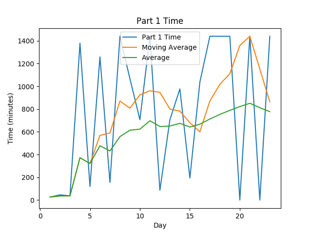
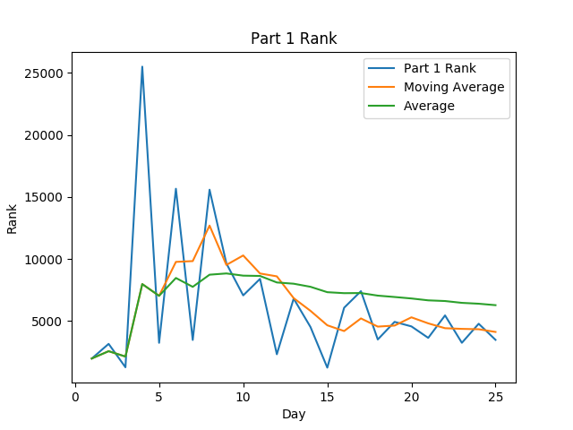
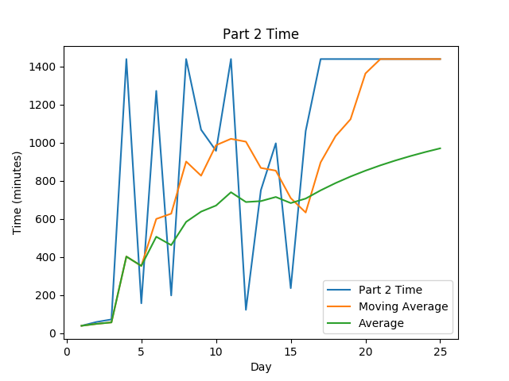
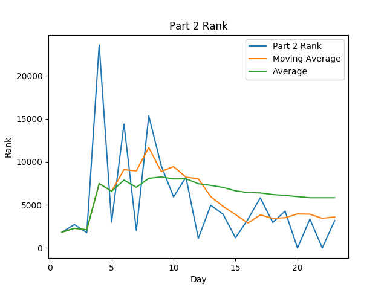

# AoC-2019
[Advent of Code](adventofcode.com) Solutions for 2019. This was my first year doing Advent of Code, I used it as an opportunity to learn Go(lang).
Some days were left incomplete, I hope to come back to complete them at some point when I have more time.

## Highlights:

#### Favorite problems:

* Day 3's Wire Problem (Specifically Part 2 where wire distance comes into play) was a fun challenge that really tested by new knowledge of
the language. 
* Day 7's multithreading was my first time doing a real application of simultaneous calculations
* A working block breaker with a basic AI? That's so cool!!
* Loved the work put into IntCode by the creators of AoC. It was amazing what it could do.

#### Interesting approaches:

* For Day 3, I originally attempted to use concurrency to step both wires simultaneously, but I was foiled by Go's built in preventions to 
inhibit concurrent map access, so I landed on a strategy of tracking wire distance along with the wire that interacted with the coordinate
before and comparing the combined steps from that. I am sure there are more efficient solutions and I have a few ideas for how I would do
it in OOP, but this is good enough for now!

## Stats
| Day | Part 1 Time (Rank) (Score) | Part 2 Time (Rank) (Score) |
|----:|----------------------------|----------------------------|
|   1 | 00:26:33 ( 1987) (  0)     | 00:39:31 ( 1841) (  0)     |
|   2 | 00:45:55 ( 3165) (  0)     | 00:59:22 ( 2722) (  0)     |
|   3 | 00:37:34 ( 1279) (  0)     | 01:12:42 ( 1774) (  0)     |
|   4 | 22:58:45 (25507) (  0)     | 24:00:00 (23574) (  0)     |
|   5 | 01:59:30 ( 3248) (  0)     | 02:37:27 ( 2997) (  0)     |
|   6 | 20:59:10 (15667) (  0)     | 21:12:42 (14373) (  0)     |
|   7 | 02:34:51 ( 3481) (  0)     | 03:18:43 ( 2031) (  0)     |
|   8 | 24:00:00 (15590) (  0)     | 24:00:00 (15342) (  0)     |
|   9 | 17:46:15 ( 9648) (  0)     | 17:49:01 ( 9574) (  0)     |
|  10 | 11:46:28 ( 7072) (  0)     | 15:58:12 ( 5927) (  0)     |
|  11 | 23:56:12 ( 8402) (  0)     | 24:00:00 ( 8209) (  0)     |
|  12 | 01:26:42 ( 2328) (  0)     | 02:03:07 ( 1112) (  0)     |
|  13 | 11:45:51 ( 6814) (  0)     | 12:31:12 ( 4959) (  0)     |
|  14 | 16:16:57 ( 4525) (  0)     | 16:37:36 ( 3903) (  0)     |
|  15 | 03:14:01 ( 1249) (  0)     | 03:56:58 ( 1177) (  0)     |
|  16 | 17:17:17 ( 6078) (  0)     | 17:42:15 ( 3332) (  0)     |
|  17 | 24:00:00 ( 7414) (  0)     | 24:00:00 ( 5819) (  0)     |
|  18 | 24:00:00 ( 3520) (  0)     | 24:00:00 ( 2967) (  0)     |
|  19 | 24:00:00 ( 4939) (  0)     | 24:00:00 ( 4276) (  0)     |
|  21 | 24:00:00 ( 3649) (  0)     | 24:00:00 ( 3351) (  0)     |
|  23 | 24:00:00 ( 3251) (  0)     | 24:00:00 ( 3180) (  0)     |
| Avg | 14:11:02 ( 6610) (  0)     | 12:24:42 ( 5830) (  0)     |

 
 

Note: Times are from time of challenge release, not my start time to completion time

## Scripting initially based on a script from [Ullaakut](https://github.com/Ullaakut/aoc19). Expanded upon by [HBiede](https://github.com/Ullaakut/hbiede)
#### Makefile Automation
* Automatically downloads the challenge and input for the day (e.g.: `make download DAY=03`)
  * In order to use this target, you need to specify your session cookie from adventofcode.com in cookies.txt through the usage of `make cookie SESSION={Insert your session cookie here}`.
  * Parses the challenge into a markdown file (adds Markdown style headers and code blocks).
  * Per Ullaakut, this part still needs a bit of work, as multiline code blocks are not supported yet, and formatting (bold, italics etc.) is lost.
* Setup the new day's source file from a template file while downloading the input and challenge per above (e.g.: `make DAY=03`)
* Create the stats table above by calling `make stats`
  * May require calling `sh scripts/install_stats_dependencies.sh` to ensure you have all the necessary python dependencies
