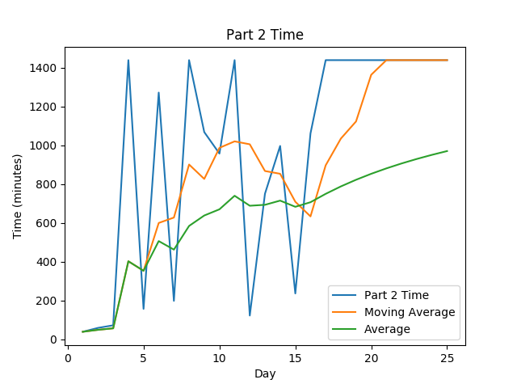

# AoC-2019
[Advent of Code](adventofcode.com) Solutions for 2019. This is my first year doing Advent of Code, used it as an opportunity to learn Go(lang)

## Highlights:

#### Favorite problems:

* Day 3's Wire Problem (Specifically Part 2 where wire distance comes into play) was a fun challenge that really tested by new knowledge of
the language. 
* Day 7's multithreading was my first time doing a real application of simultaneous calculations
* A working block breaker with a basic AI? That's so cool!!

#### Interesting approaches:

* For Day 3, I originally attempted to use concurrency to step both wires simultaneously, but I was foiled by Go's built in preventions to 
inhibit concurrent map access, so I landed on a strategy of tracking wire distance along with the wire that interacted with the coordinate
before and comparing the combined steps from that. I am sure there are more efficient solutions and I have a few ideas for how I would do
it in OOP, but this is good enough for now!

#### Leaderboard appearances:

* Not likely given that I'm only just learning Go, but you never know...

## Stats
STATS_TABLE

 
 

Note: Times are from time of challenge release, not my start time to completion time

## Scripting initially based on a script from [Ullaakut](https://github.com/Ullaakut/aoc19)
#### Makefile Automation
* Automatically downloads the challenge and input for the day (e.g.: `make download DAY=03`)
  * In order to use this target, you need to specify your session cookie from adventofcode.com in cookies.txt through the usage of `make cookie SESSION={Insert your session cookie here}`.
  * Parses the challenge into a markdown file (adds Markdown style headers and code blocks).
  * Per Ullaakut, this part still needs a bit of work, as multiline code blocks are not supported yet, and formatting (bold, italics etc.) is lost.
* Setup the new day's source file from a template file while downloading the input and challenge per above (e.g.: `make DAY=03`)
* Create the stats table above by calling `make stats`
  * May require calling `sh scripts/install_stats_dependencies.sh` to ensure you have all the necessary python dependencies
